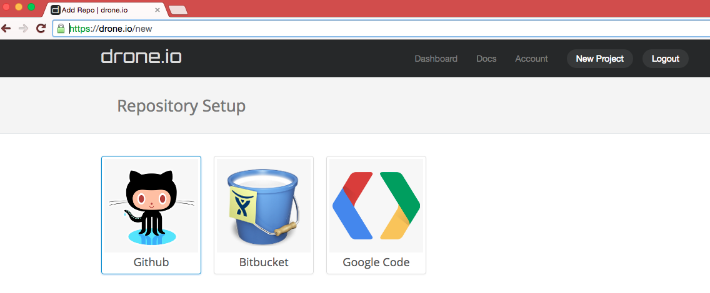
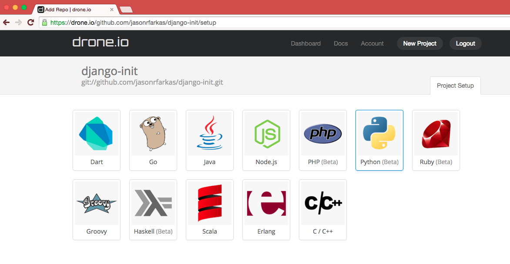
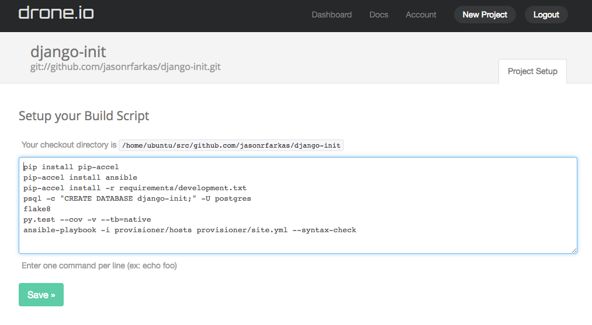
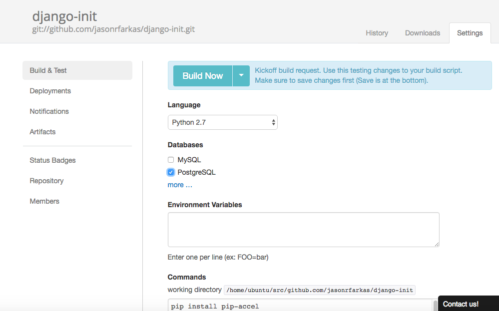
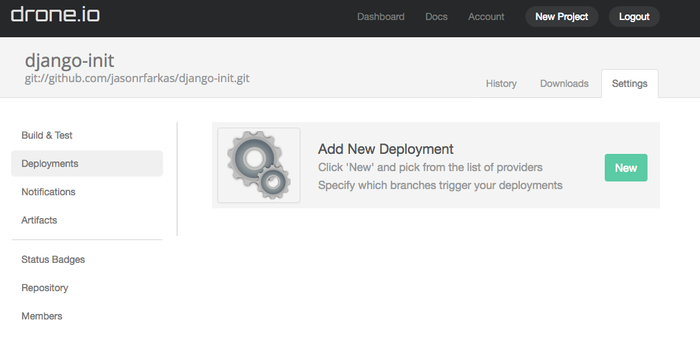
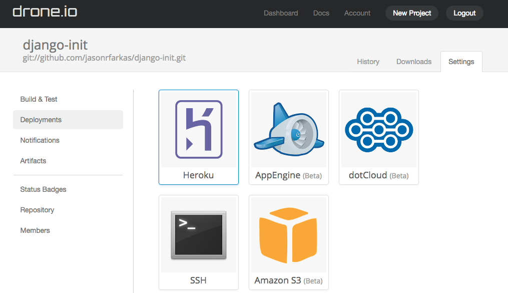
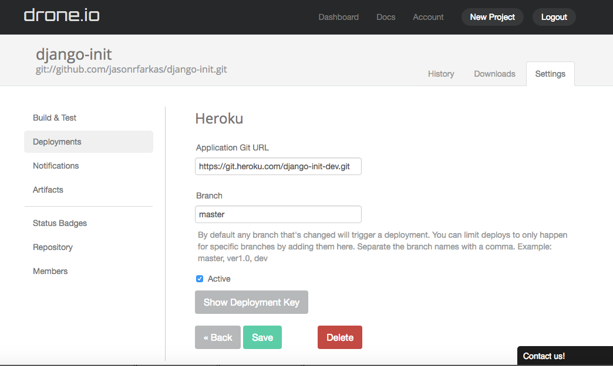

# Travis

	TODO

# Circleci

	TODO

# Drone.io and Drone

## Setting up {{ cookiecutter.main_module }} with Drone.io Continuous Integration

Drone.io is a hosting platform that uses the open source drone software. 
To learn more about drone and setting up your personal server to run CI testing visit [github](https://github.com/drone/drone) and [their docs/forums](http://readme.drone.io/community/overview/). [This](http://linoxide.com/linux-how-to/setup-drone-continuous-integration-linux/) may also be helpful. 

### Instructions:
1. ###### Head to [Drone.io](https://drone.io)

2. ###### Sign up for desired plan

3. [Login](https://drone.io/login)
You can login with your hosting service account


4. ###### [Start a new project](https://drone.io/new) and select where to look for your repo


5. ###### Select ` {{cookiecutter.github_repository}} ` for your repo

6. ###### Setup the project by selecting python 


7. ###### Setup your Build Script by replacing the text field with the following: 
 
```
pip install pip-accel
pip-accel install ansible
pip-accel install -r requirements/development.txt

psql -c "CREATE DATABASE {{ cookiecutter.main_module }};" -U postgres

psql -c "CREATE EXTENSION postgis;" -U postgres -d {{ cookiecutter.main_module }}


flake8
py.test --cov -v --tb=native
ansible-playbook -i provisioner/hosts provisioner/site.yml --syntax-check
```

8. ###### Click "Save"


9. ###### Insure Python version is correct, or change as needed. 
Note: At this time not all versions are available

10. ###### Select PostgreSQL 


11. ###### Click "Build Now"
Your project will now be built and script will be run when drone.io recognizes activity on this repo


### Set up Heroku deployment with Drone.io

1. ######  Click ( "Deployment" )[https://drone.io/github.com/{{ cookiecutter.github_username }}/{{ cookiecutter.github_repository }}/admin/deployments#/]

2. ###### Click "New"


3. ###### Click "Heroku"


4. ###### Add `https://git.heroku.com:{{ cookiecutter.main_module }}-dev.git` under the Application Git URL

5. ###### Add `master` under Branch

6. ###### Add the deployment key to Heroku account
You can do this by showing the deployment key, copying it, going to (Heroku)[https://dashboard.heroku.com/account] and adding it as a registered SSH key

7. ###### Click Save


8. ###### To have deployment for other branches including testing and production repeat steps 3 --> 7 with:
    - {{ cookiecutter.main_module }}-qa for branch qa
    - {{ cookiecutter.main_module }}-prod for branch prod

9. ###### To change email reception settings click on notifications


